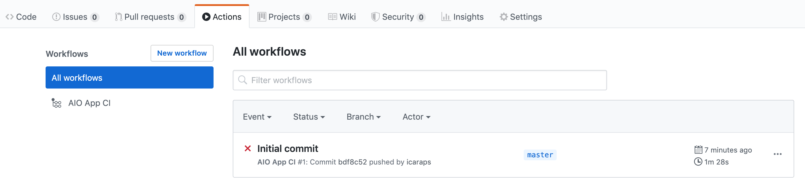

## Lesson 1: Setup CI/CD

Project Firefly comes with pre-defined GitHub actions to manage your CI/CD workflow. **GitHub actions can only work once the Firefly app and the corresponding GitHub actions are committed to a GitHub repository.**

### Setup your GitHub repository for your Firefly App

To put your Firefly App up on GitHub, you'll need to create a repository for it to live in. You can follow these [steps](https://help.github.com/en/github/getting-started-with-github/create-a-repo) to create an empty repository.
Once your repository is available on GitHub, you can copy your repository url e.g. `https://github.com/<org>/<project_name>.git`.

Then in the command line, use `git clone https://github.com/<org>/<project_name>.git` to clone the repository to your local system.

Go to the project folder with `cd <project_name>` and run the command `aio app init` to bootstrap a new Project Firefly Application from the [CLI](https://github.com/adobe/aio-cli), the application generator will ask whether to include GitHub Actions based workflows for Build, Test and Deploy.


### GitHub actions

By selecting the CI/CD workflow option, the application code will be initialized with an additional `.github` folder at its root. This folder contains default GitHub Workflows that can be extended if needed: 

**pr_test.yml** is the GitHub action that will run the App unit tests on the stage environment by calling `aio app test` against the requested changes. It will run anytime the [pull_request](https://help.github.com/en/actions/reference/events-that-trigger-workflows#pull-request-event-pull_request) event occurs.

```yaml
name: AIO App CI

on: [pull_request]
jobs:
  test:
    name: Test PR
    runs-on: ${{ matrix.os }}
    strategy:
      matrix:
        node-version: ['12']
        os: [macOS-latest, ubuntu-latest, windows-latest]
    steps:
      - name: Checkout
        uses: actions/checkout@v2
      - name: Use Node.js ${{ matrix.node-version }}
        uses: actions/setup-node@v1
        with:
          node-version: ${{ matrix.node-version }}
      - name: npm install
        run: npm i
      - name: Setup CLI
        uses: adobe/aio-cli-setup-action@1.0.0
        with:
          os: ${{ matrix.os }}
      - name: Build
        uses: adobe/aio-apps-action@1.0.0
        with:
          os: ${{ matrix.os }}
          command: build
          AIO_RUNTIME_NAMESPACE: ${{ secrets.AIO_RUNTIME_NAMESPACE_STAGE }}
      - name: Test
        uses: adobe/aio-apps-action@1.0.0
        with:
          os: ${{ matrix.os }}
          command: test
```

**deploy_stage.yml** is the GitHub action that will deploy the Firefly App to the stage environment on every new commit on the `master` branch by calling `aio app deploy`. 
It will run anytime the [push](https://help.github.com/en/actions/reference/events-that-trigger-workflows#push-event-push) event occurs on the `master` branch. 

```yaml
name: AIO App CI

on:
  push:
    branches:
      - master
jobs:
  deploy:
    name: Deploy to Stage
    runs-on: ${{ matrix.os }}
    strategy:
      max-parallel: 1
      matrix:
        node-version: ['12']
        os: [ubuntu-latest]
    steps:
      - name: Checkout
        uses: actions/checkout@v2
      - name: Use Node.js ${{ matrix.node-version }}
        uses: actions/setup-node@v1
        with:
          node-version: ${{ matrix.node-version }}
      - name: npm install
        run: npm i
      - name: Setup CLI
        uses: adobe/aio-cli-setup-action@1.0.0
        with:
          os: ${{ matrix.os }}
      - name: Build
        uses: adobe/aio-apps-action@1.0.0
        with:
          os: ${{ matrix.os }}
          command: build
          AIO_RUNTIME_NAMESPACE: ${{ secrets.AIO_RUNTIME_NAMESPACE_STAGE }}
      - name: Deploy
        uses: adobe/aio-apps-action@1.0.0
        with:
          os: ${{ matrix.os }}
          command: deploy
          AIO_RUNTIME_AUTH: ${{ secrets.AIO_RUNTIME_AUTH_STAGE }}
          AIO_RUNTIME_NAMESPACE: ${{ secrets.AIO_RUNTIME_NAMESPACE_STAGE }}
```

**deploy_prod.yml** is the GitHub action that will deploy the Firefly App to the production environment by calling `aio app deploy`. It will run anytime the [release](https://help.github.com/en/actions/reference/events-that-trigger-workflows#release-event-release) event occurs. Please read [GitHub's documentation ](https://help.github.com/en/github/administering-a-repository/managing-releases-in-a-repository) to learn how to perform releases. 

```yaml
name: AIO App CI

on:
  release:
    types: [published]
jobs:
  deploy:
    name: Deploy to Prod
    runs-on: ${{ matrix.os }}
    strategy:
      max-parallel: 1
      matrix:
        node-version: ['12']
        os: [ubuntu-latest]
    steps:
      - name: Checkout
        uses: actions/checkout@v2
      - name: Use Node.js ${{ matrix.node-version }}
        uses: actions/setup-node@v1
        with:
          node-version: ${{ matrix.node-version }}
      - name: npm install
        run: npm i
      - name: Setup CLI
        uses: adobe/aio-cli-setup-action@1.0.0
        with:
          os: ${{ matrix.os }}
      - name: Build
        uses: adobe/aio-apps-action@1.0.0
        with:
          os: ${{ matrix.os }}
          command: build
          AIO_RUNTIME_NAMESPACE: ${{ secrets.AIO_RUNTIME_NAMESPACE_PROD }}
      - name: Deploy
        uses: adobe/aio-apps-action@1.0.0
        with:
          os: ${{ matrix.os }}
          command: deploy
          AIO_RUNTIME_AUTH: ${{ secrets.AIO_RUNTIME_AUTH_PROD }}
          AIO_RUNTIME_NAMESPACE: ${{ secrets.AIO_RUNTIME_NAMESPACE_PROD }} 
```  

The back-end serverless actions get deployed to Runtime, while the SPA gets deployed to the out-of-the-box CDN for every deployment whether to stage or production.    

For that, we'll push the project on GitHub with `git commit "Initial commit" && git push origin master` which will commit the Firefly App to the `master` branch of the GitHub repository.

The GitHub actions defined in `deploy_stage.yml` will run by default. Go to `https://github.com/<org>/<project_name>/actions` to see the workflow running:



**By default, the workflow will fail as we didn't specify the GitHub secrets yet.**

### GitHub secrets

To differentiate stage from production, the GitHub actions rely on [GitHub secrets](https://help.github.com/en/actions/configuring-and-managing-workflows/creating-and-storing-encrypted-secrets).
Encrypted secrets allow you to store sensitive information, such as access tokens, in your repository. 

By default, the secrets required for `deploy_prod.yml` for the **production environment** are named: 
* `AIO_RUNTIME_NAMESPACE_PROD`
* `AIO_RUNTIME_AUTH_PROD`

And the secrets required for `deploy_stage.yml` and `pr_test.yml` for the **stage environment** are named: 
* `AIO_RUNTIME_NAMESPACE_STAGE`
* `AIO_RUNTIME_AUTH_STAGE`

To add a secret to your project:
1. Go to `https://github.com/<org>/<project_name>/settings/secrets`
2. Type the name of your secret e.g. `AIO_RUNTIME_NAMESPACE_PROD` in the "Name" input box.
3. Type the value for your secret. 


If you can't add secrets to the repository, the reason could be that:
* You're not the repository owner if the repository is a user account repository.
* You don't have admin access for an organization repository.
* You don't have write access to the repository if you're using the [GitHub Actions secrets API](https://developer.github.com/v3/actions/secrets/#create-or-update-a-secret-for-a-repository)

**The secrets value can be retrieved in the [Developer Console](https://console.adobe.io/)** from where you can download the stage and production namespace and credential. 

  

Next lesson: [Monitoring CI/CD](lesson2.md)